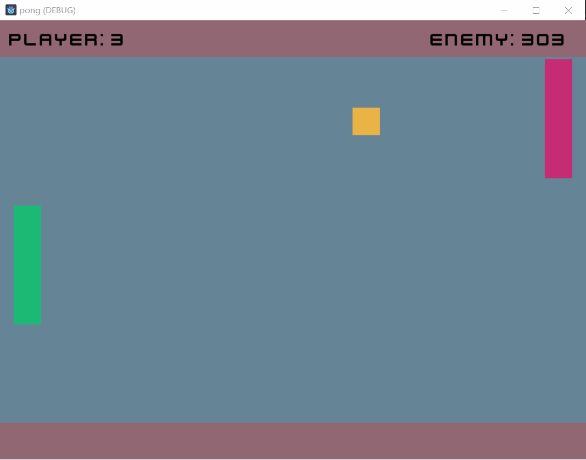

# Pong - Godot GameT

The repo is inspired by the [ElCapor/GDExtension-Games](https://github.com/ElCapor/GDExtension-Games/tree/multiplayer-pong) repo.

Pong is a simple classic game made by Atari in 1972. The game is a two-player game where each player controls a paddle and tries to hit the ball past the other player's paddle. I tried to implement this game using the Godot game engine, especially the GDExtension library.

## Requirements

Godot 4.3 stable or newer.

Only use the GDExtension, not including GDNative, GDScript, or VisualScript.

## Features

- [x] Single player mode (vs AI)
- [x] Add score system
- [ ] Add sound effects
- [ ] Add User Interface
- [ ] Add multiplayer mode (networking)

## Reference

- [ElCapor/GDExtension-Games at multiplayer-pong](https://github.com/ElCapor/GDExtension-Games/tree/multiplayer-pong)
